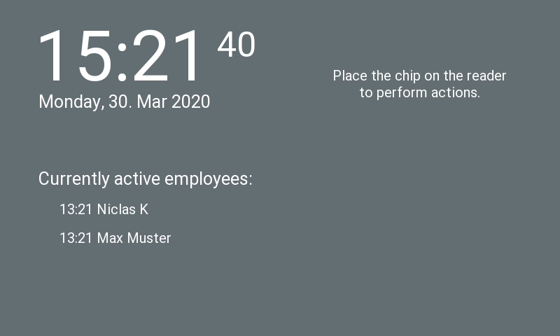
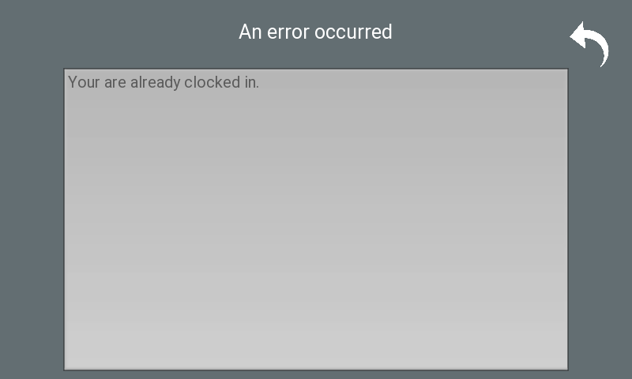
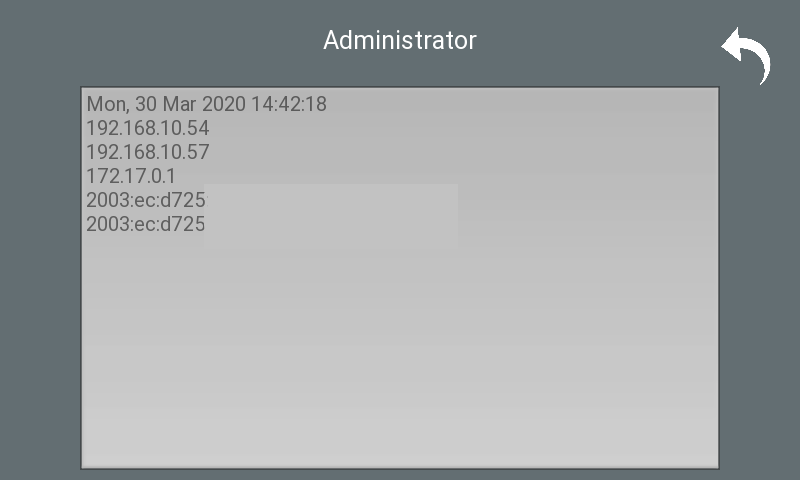

# Rasptime_Client
This is a python timeclock application running on a Raspberry Pi Zero W with attached touch screen, rfid reader 
and small speaker for audio feedback.
It's part of a bigger project where you also make use of a SpringBoot backend and a React Frontend for mobile/desltop view.
This particular implementation is only for the client which processes the rfid tags.
It allows your employees to clock in/out. A short response screen is shown for clock in or clock out.
Instructions on how to print the case and connect the hardware are in the ```hardware/``` folder.
 
## Operating System
Raspberry Pi OS 2025

## Update system
sudo apt update
sudo apt upgrade

## Install dependencies for Kivy and hardware
sudo apt install -y \
    libsdl2-dev libsdl2-image-dev libsdl2-mixer-dev libsdl2-ttf-dev \
    pkg-config libgl1-mesa-dev libgles2-mesa-dev \
    libgstreamer1.0-dev git-core \
    gstreamer1.0-plugins-{bad,base,good,ugly} \
    gstreamer1.0-{omx,alsa} \
    python3-dev python3-pip python3-venv \
    libmtdev-dev libjpeg-dev \
    xclip xsel

## Create/activate virtual environment
python3 -m venv ~/timetrack
source ~/timetrack/bin/activate

## Install Python packages in venv (updated versions)
pip install --upgrade pip
pip install \
    Cython \
    pillow \
    kivy \
    pygments \
    spidev \
    mfrc522 \
    RPi.GPIO

## Configuration
Set locale and timezone.
```
sudo raspi-config
```

Modify ```/boot/config.txt``` to support touchscreen and RFID reader.
```
hdmi_group=2
hdmi_mode=87
hdmi_cvt 800 480 60 6 0 0 0
hdmi_drive=1
hdmi_force_hotplug=1
display_rotate=2
dtparam=i2c_arm=on
dtparam=spi=on
dtoverlay=ads7846,penirq=25,speed=10000,keep_vref_on=0,penirq_pull=2,xohms=150
dtoverlay=spi1-1cs
```

Modify kivy ```~/.kivy/config.ini``` to invert touchscreen x-axis (file is created during 
import of kivy).
```
[input]
mouse = mouse
%(name)s = probesysfs,provider=hidinput,param=invert_x=1
```

## Configuration

Edit `config.py` to match your setup. Currently supported languages: 'de', 'en'.
```python
"""
Timeclock server address
"""
hostname = 'localhost'
port = '8000'

"""
Authorization of the timeclock's server special terminal user
"""
terminal_id = '4'
api_key = 'tRu4Y316ypP6Kfce4L4c'

"""
Locale has to be installed on the system
Languages currently supported: de, en
"""
locale = 'en_US.utf8'
lang = 'en'

"""
RFID Reader (RC522) Configuration
SPI Bus and Device: /dev/spidev{bus}.{device}
Using SPI0 CE0 for RFID reader
"""
bus = 0          # SPI bus (spidev0.x)
device = 0       # Chip select (CE0)
irq = None       # Not connected
rst = 24         # GPIO 24 (Pin 18) - Reset pin

"""
Buzzer Configuration (TMB12A03)
"""
buzzer_pin = 13  # GPIO 13 (Pin 33)
```

## Hardware Setup

### Pin Connections Summary

**RC522 RFID Reader:**
- 3.3V → Pin 1 or 17
- GND → Any ground pin (9, 14, 20, 30, 34, or 39)
- MOSI → Pin 19 (GPIO 10) - Shared with display
- MISO → Pin 21 (GPIO 9) - Shared with display  
- SCK → Pin 23 (GPIO 11) - Shared with display
- SDA/CS → Pin 24 (GPIO 8/CE0) - RFID chip select
- RST → Pin 18 (GPIO 24) - Reset
- IRQ → Not connected

**XPT2046 Touchscreen Display:**
- 5V → Pin 2 or 4
- GND → Pin 6 or 25
- MOSI → Pin 19 (GPIO 10) - Shared with RFID
- MISO → Pin 21 (GPIO 9) - Shared with RFID
- SCK → Pin 23 (GPIO 11) - Shared with RFID
- CS → Pin 26 (GPIO 7/CE1) - Display chip select
- IRQ → Pin 22 (GPIO 25) - Interrupt

**TMB12A03 Active Buzzer:**
- (+) → Pin 11 (GPIO 17) - Control
- GND → Any ground pin (9)

## Usage

The application automatically downloads all user data from the timeclock server (profile pictures should be 283x420px).

**Start the application:**
```bash
# Activate virtual environment
source ~/timetrack/bin/activate

# Run the terminal application inside the repository
python3 terminal.py
```

**Key Configuration Notes:**
- RFID reader uses SPI0 CE0 (`/dev/spidev0.0`)
- Touchscreen uses SPI0 CE1 (`/dev/spidev0.1`) 
- Both devices share MOSI, MISO, and SCK lines
- Different chip select (CS) pins allow independent communication

## Autostart with systemd
Save to ```/etc/systemd/system/rasptime.service```:
```bash
sudo nano /etc/systemd/system/rasptime.service
```
```
[Unit]
Description=rasptime_client
After=network-online.target graphical.target
Wants=network-online.target

[Service]
Type=simple
User=admin
WorkingDirectory=/home/admin/rasptime_client
Environment=DISPLAY=:0
Environment=XAUTHORITY=/home/admin/.Xauthority
ExecStartPre=/usr/bin/git -C /home/admin/rasptime_client pull --ff-only
ExecStart=/home/admin/timetrack-env/bin/python -u /home/admin/rasptime_client/terminal.py
Restart=always
RestartSec=3
StandardOutput=journal
StandardError=journal

[Install]
WantedBy=graphical.target
```

Enable and start (autostart) the service:
```bash
sudo systemctl daemon-reload
sudo systemctl enable rasptime.service
sudo systemctl enable rpi-timeclock-terminal.service
sudo systemctl start rpi-timeclock-terminal.service
```

If an error occurs try to debug the settings:
```bash
systemctl cat rasptime.service
getent passwd admin
ls -ld /home/admin /home/admin/rasptime-client /home/admin/timetrack-env
sudo -u admin test -d /home/admin/rasptime-client && echo repo_ok
sudo -u admin test -x /home/admin/timetrack-env/bin/python && echo venv_ok
```

## WiFi Setup
Valid for Raspberry Pi OS versions using NetworkManager (`nmcli`), including Bookworm and Trixie (Debian 13).

### Add a new WiFi profile (network is available)
```bash
sudo nmcli --ask dev wifi connect 'YOUR_SSID' name 'wifi-main'
sudo nmcli connection modify 'wifi-main' connection.autoconnect yes connection.autoconnect-priority 100
sudo nmcli connection up id 'wifi-main'
```

### Preconfigure a WiFi profile (network is currently not available)
```bash
sudo nmcli connection add type wifi ifname wlan0 con-name 'wifi-main' ssid 'YOUR_SSID'
sudo nmcli connection modify 'wifi-main' \
  wifi-sec.key-mgmt wpa-psk \
  wifi-sec.psk 'YOUR_WIFI_PASSWORD' \
  connection.autoconnect yes \
  connection.autoconnect-priority 100
```

For hidden SSIDs:
```bash
sudo nmcli connection modify 'wifi-main' 802-11-wireless.hidden yes
```

### Edit existing profiles
```bash
# List saved profiles
nmcli connection show

# Change password of an existing profile
sudo nmcli connection modify 'wifi-main' wifi-sec.psk 'NEW_WIFI_PASSWORD'

# Rename a profile
sudo nmcli connection modify 'wifi-main' connection.id 'office-main'

# Enable autoconnect and priority
sudo nmcli connection modify 'office-main' connection.autoconnect yes connection.autoconnect-priority 100
```

### Watchdog setup
Use the kernel + systemd watchdog so the device can recover from hangs more reliably.

Add to `/boot/firmware/config.txt`:
```ini
kernel_watchdog_timeout=30
```

Add to `/etc/systemd/system.conf`:
```ini
RuntimeWatchdogSec=15s
```

Apply changes:
```bash
sudo systemctl daemon-reexec
sudo reboot
```

### Backup plan on desktop (`BackupWifiConnect.sh`)
Create `/home/admin/Desktop/BackupWifiConnect.sh`:
```bash
#!/usr/bin/env bash
set -euo pipefail

KNOWN_CONNECTIONS=('wifi-main' 'office-main' 'phone-hotspot')

for conn in "${KNOWN_CONNECTIONS[@]}"; do
  if nmcli -t -f NAME connection show | grep -Fxq "$conn"; then
    echo "Trying: $conn"
    if nmcli connection up id "$conn"; then
      echo "Connected via $conn"
      exit 0
    fi
  fi
done

echo "No known network could be activated."
exit 1
```

Make it executable:
```bash
chmod +x /home/admin/Desktop/BackupWifiConnect.sh
```

## Debugging
### Connect over SSH
From your local machine (`rasptime` is the hostname used in this setup; in other setups this can be an IP address):
```bash
ssh admin@rasptime
```

### Search logs for errors
Example (time-range query for service logs):
```bash
sudo journalctl -u rasptime.service --since "2026-03-03 22:20:00" --until "2026-03-03 23:01:00" --no-pager
```

Optional: filter by typical error keywords:
```bash
sudo journalctl -u rasptime.service --since "2026-03-03 22:20:00" --until "2026-03-03 23:01:00" --no-pager | \
  egrep -i "error|warning|exception|traceback|rfid|buzzer"
```

### Restart service
```bash
sudo systemctl restart rasptime.service
```

## Screenshots






Photos of the hardware can be found in `hardware/` folder.

## Translations
Translations are in the ```lang/``` folder. You can use the following commands to initialize, update and
compile new translations (e.g 'de').
```
# Get translatable texts and create .pot file
xgettext -Lpython --from-code utf-8 --output=terminal.pot terminal.py terminal.kv dataprovider.py rfidprovider.py

# Initialize .po file
msginit --no-translator -o lang/de/LC_MESSAGES/terminal.po -i terminal.pot

# Update .po file
msgmerge --update --no-fuzzy-matching --backup=off lang/de/LC_MESSAGES/terminal.po terminal.pot

# Compile .po file
msgfmt -c -o lang/de/LC_MESSAGES/terminal.mo lang/de/LC_MESSAGES/terminal.po
```

## Colours
- Red 9E2416
- Green 608E47
- Orange CA5122
- Brown 9E7B53

## Architecture Overview
┌─────────────────┐     ┌─────────────────┐     ┌─────────────────┐
│  React Frontend │────▶│  Spring Backend │◀────│  RPi Client     │
│  (Admin Panel)  │     │  (REST API)     │     │  (RFID Reader)  │
└─────────────────┘     └─────────────────┘     └─────────────────┘
         │                      │                       │
         │   POST /register     │   POST /punch         │
         │   (wait for RFID)    │   GET /user           │
         └──────────────────────┼───────────────────────┘
                                │
                         ┌──────┴──────┐
                         │  PostgreSQL │
                         └─────────────┘
